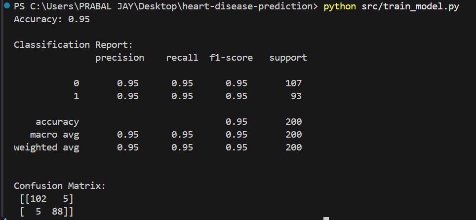
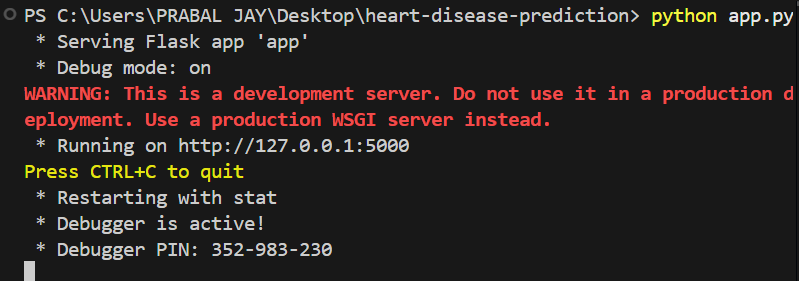
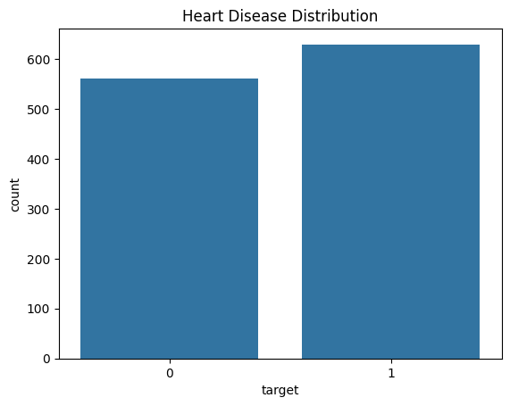

# ❤️ Heart Disease Prediction

A modern web application that predicts the likelihood of heart disease using machine learning.  
Built with **Flask**, **scikit-learn**, and a visually appealing, responsive interface.

[](https://github.com/PrabalJay/heart-disease-prediction)

---

## 📑 Table of Contents

- [🚀 Features](#-features)
- [🖥️ Demo](#️-demo)
- [🌐 Live Website](#-live-website)
- [📸 Output Gallery](#-output-gallery)
- [📂 Project Structure](#-project-structure)
- [⚙️ Installation](#-installation)
- [📝 Usage](#-usage)
- [📊 Model](#-model)
- [🤝 Contributing](#-contributing)
- [📄 License](#-license)
- [🙏 Acknowledgements](#-acknowledgements)

---

## 🚀 Features

- 🖥️ **Interactive Web App:** User-friendly form for inputting patient data.
- 🤖 **Machine Learning Model:** Trained on real-world heart disease data.
- 📊 **Data Visualization:** Explore the dataset with insightful charts.
- 🎨 **Attractive UI:** Modern, responsive, and easy to use.
- 🔄 **Customizable:** Easily retrain or update the model with new data.

---

## 🖥️ Demo

<p align="center">
  
</p>

---

## 🌐 Live Website

<p align="center">
  <a href="https://prabaljay.github.io/heart-disease-prediction/" target="_blank">
    
  </a>
</p>

---

## 📸 Output Gallery

<div align="center">

<table>
  <tr>
    <td align="center"><br>Final App</td>
    <td align="center"><br>Data Exploration</td>
    <td align="center"><br>Model Training</td>
  </tr>
  <tr>
    <td align="center"><br>Confusion Matrix</td>
    <td align="center"><br>Output Example</td>
    <td align="center"><br>App Screenshot</td>
  </tr>
  <tr>
    <td align="center"><br>Heart Disease Distribution</td>
    <td></td>
    <td></td>
  </tr>
</table>

</div>

---

## 📂 Project Structure

```
heart-disease-prediction
│
├── app.py                     # Main entry point of the Flask application
├── requirements.txt           # Lists the dependencies required for the project
├── src
│   ├── data_preprocessing.py  # Functions for data preprocessing
│   └── train_model.py         # Logic for training the machine learning model
├── data
│   ├── raw
│   │   └── dataset.csv        # Raw dataset used for training the model
│   └── processed
│       ├── X_train.csv        # Processed training features
│       ├── X_test.csv         # Processed testing features
│       ├── y_train.csv        # Processed training labels
│       └── y_test.csv         # Processed testing labels
├── images/                    # Outputs
│   ├── app.png
│   ├── final_app.png
│   ├── data.png
│   ├── train_model.png
│   ├── cm.png
│   ├── output.png
│   └── hdd.png
├── models
│   └── best_model.pkl         # Trained machine learning model
├── templates
│   └── index.html             # HTML template for the web application's home page
├── notebooks
│   └── data_exploration.ipynb # Notebook for exploratory data analysis
└── README.md                  # Documentation for the project
```

---

## ⚙️ Installation

1. **Clone the repository:**
   ```bash
   git clone https://github.com/PrabalJay/heart-disease-prediction.git
   cd heart-disease-prediction
   ```

2. **Install dependencies:**
   ```bash
   pip install -r requirements.txt
   ```

3. **Prepare the data:**
   - Place your dataset in `data/raw/dataset.csv`.
   - Run preprocessing and training scripts:
     ```bash
     python src/data_preprocessing.py
     python src/train_model.py
     ```

4. **Run the app:**
   ```bash
   python app.py
   ```
   Visit [http://127.0.0.1:5000](http://127.0.0.1:5000) in your browser.

---

## 📝 Usage

- Fill in the form with patient details.
- Click **Predict** to see the result.
- Explore data visualizations in the `notebooks/` folder.

---

## 📊 Model

- **Algorithm:** Random Forest Classifier
- **Features:** Age, Sex, Chest Pain Type, Blood Pressure, Cholesterol, etc.
- **Evaluation:** Accuracy, Confusion Matrix, Classification Report

---

## 🤝 Contributing

Pull requests are welcome! For major changes, please open an issue first.

---

## 📄 License

This project is licensed under the MIT License.

---

## 🙏 Acknowledgements

- [UCI Heart Disease Dataset](https://archive.ics.uci.edu/ml/datasets/heart+Disease)
- [Flask](https://flask.palletsprojects.com/)
- [scikit-learn](https://scikit-learn.org/)

---

<p align="center">
  <b>⭐ Star this repo if you found it useful!</b>
</p>